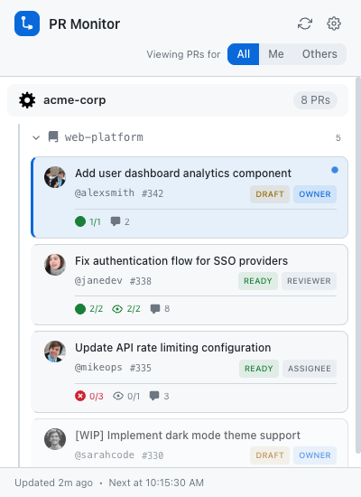
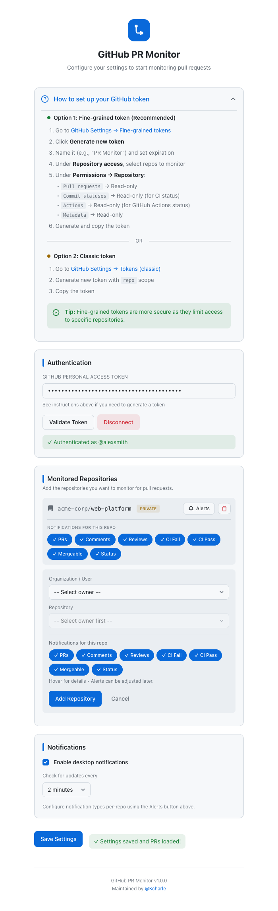
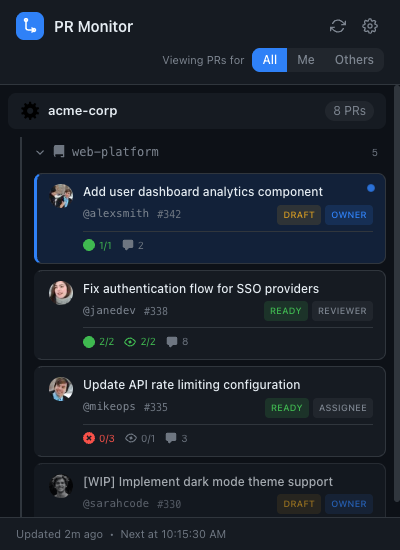
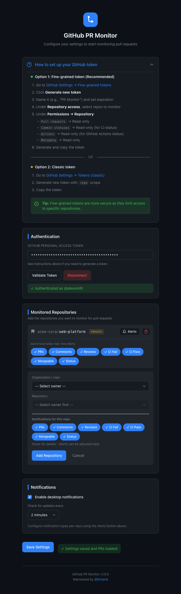

# GitHub PR Monitor

[](https://github.com/Kcharle/github-pr-chrome-extension/releases/latest)
[](https://github.com/Kcharle/github-pr-chrome-extension/releases/latest/download/github-pr-monitor.zip)

A Chrome extension that monitors GitHub pull requests where you're a reviewer, assignee, or author. Get desktop notifications for new PRs, comments, reviews, CI failures, and status changes.

## Features

- **Multi-Repo Monitoring**: Track PRs across multiple repositories and organizations
- **Activity Tracking**: Monitor comments, reviews, CI/Actions status, and PR state changes
- **Smart Notifications**: Batched desktop notifications to avoid spam, with per-repo controls
- **Author Tracking**: Track PRs you authored with visual distinction (Owner badge)
- **Filter Views**: Quick toggle between All / Mine / Others PRs in the popup
- **Collapsible Sections**: Organize PRs by organization and repository
- **Dark Mode**: Automatic theme switching based on system preference
- **Badge Count**: At-a-glance PR count on the extension icon (updates with filter)

## Screenshots

### Light Mode

| Popup | Settings |
|-------|----------|
|  |  |

### Dark Mode

| Popup | Settings |
|-------|----------|
|  |  |

## Installation

### For Users (Quick Install)

1. **[Download the latest release](https://github.com/Kcharle/github-pr-chrome-extension/releases/latest/download/github-pr-monitor.zip)**
2. Extract the zip file
3. Open Chrome and go to `chrome://extensions`
4. Enable **Developer mode** (toggle in top-right corner)
5. Click **Load unpacked** and select the extracted folder

> The download link always points to the latest version automatically.

### For Developers

1. Clone this repository:
   ```bash
   git clone https://github.com/Kcharle/git-chrome-extension.git
   cd git-chrome-extension
   ```
2. Install dependencies and build:
   ```bash
   npm install
   npm run build:ext
   ```
3. Open Chrome and navigate to `chrome://extensions/`
4. Enable **Developer mode** (toggle in top-right corner)
5. Click **Load unpacked**
6. Select the **`dist`** folder

> **Note**: Loading from `dist/` keeps the extension size small (~150KB). Loading from the project root includes `node_modules` (~25MB).

### Generate a GitHub Token

#### Option 1: Fine-grained Token (Recommended)

1. Go to [GitHub Settings → Fine-grained tokens](https://github.com/settings/tokens?type=beta)
2. Click **Generate new token**
3. Name it (e.g., "PR Monitor") and set expiration
4. Under **Repository access**, select the repos to monitor
5. Under **Permissions → Repository permissions**, set:
   - `Pull requests` → Read-only
   - `Commit statuses` → Read-only (for CI status)
   - `Actions` → Read-only (for GitHub Actions status)
   - `Metadata` → Read-only (auto-selected)
6. Click **Generate token** and copy it

#### Option 2: Classic Token

1. Go to [GitHub Settings → Tokens (classic)](https://github.com/settings/tokens)
2. Generate new token with `repo` scope
3. Copy the token

## Setup

1. Click the extension icon in Chrome toolbar
2. Click the **Settings** (gear) icon
3. Paste your GitHub Personal Access Token
4. Click **Validate Token**
5. Add repositories to monitor using the **Add Repository** button
6. Configure notification preferences (global and per-repo)
7. Click **Save Settings**

## Usage

### Popup Panel

Click the extension icon to see your PRs organized by organization and repository:

| Badge | Meaning |
|-------|---------|
| 🟢 **Ready** | Ready for review |
| 🟡 **Draft** | Draft PR |
| 🔵 **Author** | PR you created |
| ⚪ **Reviewer/Assignee** | Your role on the PR |

**Activity indicators** show:
- ✅/❌/⏳ CI status
- 👍/🔄/💬 Review status
- 💬 Comment count

**Filter toggle**: Switch between **All** / **Me** (authored) / **Others** (reviewing)

Click any PR card to open it in GitHub.

### Notifications

When enabled, you'll receive desktop notifications for:
- New PRs assigned to you
- New comments on your PRs
- Review submissions (approved, changes requested)
- CI/Action failures and successes
- Ready to merge (CI passed + approved)
- PR status changes (draft → ready, merged, closed)

Notifications are **batched** to avoid spam. Per-repo notification controls let you fine-tune which alerts you receive.

### Badge Count

The extension icon shows:
- **Red number**: PR count (updates based on your filter selection)
- **Gray ?**: Extension not configured

## Configuration

| Setting | Description | Default |
|---------|-------------|---------|
| GitHub Token | Personal access token | Required |
| Repositories | Repos to monitor (multi-select) | Required |
| Notifications | Desktop notification toggle | Enabled |
| Poll Interval | Check frequency | 2 minutes |
| Per-Repo Alerts | Granular notification control | All enabled |

### Notification Types

| Type | Description |
|------|-------------|
| PRs | New PRs where you're reviewer/assignee |
| Comments | New comments on tracked PRs |
| Reviews | Review submissions (approved, changes requested) |
| CI Fail | GitHub Actions/Checks failures |
| CI Pass | All CI checks passed |
| Mergeable | PR is approved and CI passed (ready to merge) |
| Status | PR state changes (draft, ready, merged, closed) |

## Troubleshooting

### "Invalid token" error
- Verify the token hasn't expired
- For **fine-grained tokens**: ensure these permissions are set:
  - `Pull requests` → Read-only
  - `Commit statuses` → Read-only (for CI status)
  - `Actions` → Read-only (for GitHub Actions status)
- For **classic tokens**: ensure `repo` scope is selected

### CI status not showing
- Ensure your fine-grained token has `Actions` and `Commit statuses` permissions
- Some external CI systems (Jenkins, CircleCI) use Commit Statuses; GitHub Actions uses the Actions API

### PRs not showing up
- Verify you're a reviewer, assignee, or author on the PRs
- Check you've added the correct repository
- Click the refresh button to manually update

### Notifications not appearing
- Check Chrome's notification settings for this extension
- Verify notifications are enabled in extension settings
- Check per-repo notification toggles
- Make sure "Do Not Disturb" mode is off on your system

## Privacy

This extension:
- Only communicates with `api.github.com`
- Stores your token locally in Chrome's secure storage
- Does not collect or transmit any analytics
- Is fully open source

## Development

```bash
# Clone the repository
git clone https://github.com/Kcharle/git-chrome-extension.git
cd git-chrome-extension

# Install dependencies
npm install

# Build CSS only
npm run build:css

# Build extension to dist/ folder
npm run build:ext

# Watch for CSS changes during development
npm run watch:css
```

### Creating a Release

Releases are automated via GitHub Actions. To create a new release:

```bash
git tag v1.0.0
git push origin v1.0.0
```

This automatically builds the extension and publishes it to [GitHub Releases](https://github.com/Kcharle/git-chrome-extension/releases).

### Project Structure

```
git-chrome-extension/
├── manifest.json           # Extension manifest (v3)
├── background.js           # Service worker (polling, notifications, badge)
├── tailwind.config.js      # Tailwind configuration
├── postcss.config.js       # PostCSS plugins
├── package.json            # Dependencies and scripts
├── src/styles/
│   ├── base.css            # Shared theme (GitHub Primer colors)
│   ├── input.css           # Options page source
│   └── popup-input.css     # Popup source
├── popup/
│   ├── popup.html          # Popup UI
│   ├── popup.css           # Compiled styles
│   └── popup.js            # Popup logic
├── options/
│   ├── options.html        # Settings page
│   ├── options.css         # Compiled styles
│   └── options.js          # Settings logic
├── icons/                  # Extension icons (16, 48, 128px)
└── dist/                   # Built extension (load this in Chrome)
```

### Styling

Uses **Tailwind CSS** with **GitHub Primer** colors. Theme automatically switches between light/dark based on system preference via CSS `prefers-color-scheme`.

CSS variables defined in `src/styles/base.css`:
- `--bg-primary`, `--bg-secondary`, `--bg-tertiary`
- `--text-primary`, `--text-secondary`, `--text-muted`
- `--accent`, `--success`, `--warning`, `--error`

## Credits

Maintained by [@Kcharle](https://github.com/Kcharle)

## License

MIT
